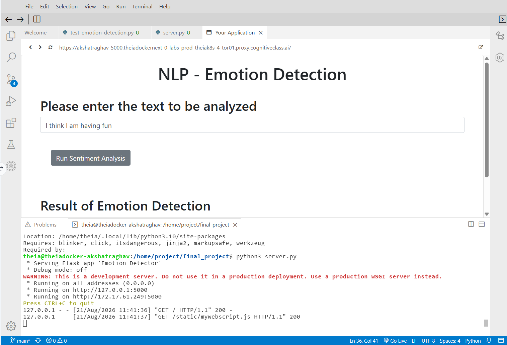
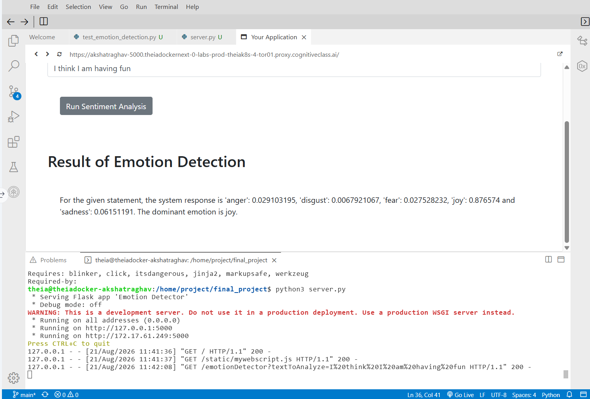
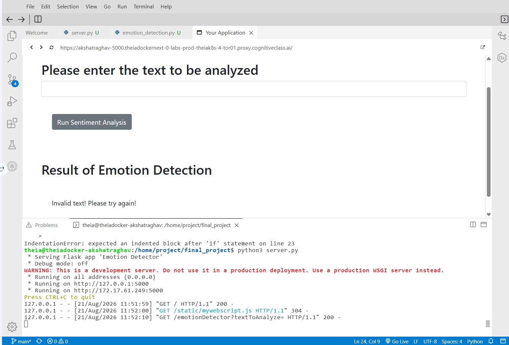
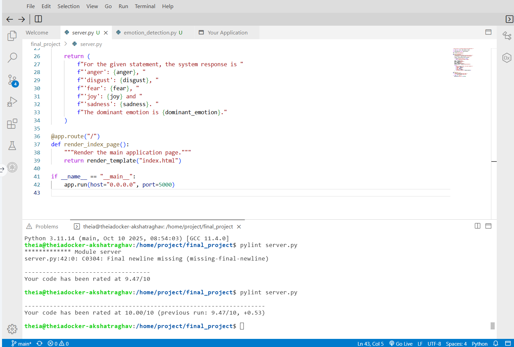

# AI-Based Emotion Detection

An AI-powered web application that analyzes text and identifies the emotions expressed in it using IBM Watson NLP.

The application detects five emotions — **anger, disgust, fear, joy, and sadness** — and identifies the dominant emotion based on the highest confidence score.

## Features

- Detects 5 different emotions from text
- Identifies the dominant emotion
- Displays confidence scores for each emotion
- Interactive web interface using Flask
- Handles blank or invalid user input
- Unit tested for multiple emotion scenarios
- Pylint code quality score: **10/10**

## Technologies Used

- Python
- Flask
- IBM Watson NLP
- REST API
- Requests
- JSON
- Unittest
- Pylint
- HTML
- JavaScript

## How It Works

User Text
→ Flask Web Application
→ Watson NLP Emotion Detection
→ Emotion Scores
→ Dominant Emotion
→ Result Displayed to User

## Emotions Detected

| Emotion | Description |
|---|---|
| Anger | Detects angry or frustrated expressions |
| Disgust | Detects expressions of dislike or disgust |
| Fear | Detects fearful or anxious expressions |
| Joy | Detects happy and positive expressions |
| Sadness | Detects sad or unhappy expressions |

## Example

### Input

I think I am having fun

### Output

The application analyzes the statement and returns scores for:

- Anger
- Disgust
- Fear
- Joy
- Sadness

**Dominant Emotion: Joy**

## Project Screenshots

### Emotion Detection Result

The application analyzes the entered text, calculates individual emotion scores, and identifies the dominant emotion.

### Error Handling

Blank or invalid input is handled gracefully without crashing the application.

### Code Quality

Static code analysis was performed using Pylint, achieving a **10.00/10** score.

## Project Structure

    AI-based-Emotion-Detection/
    │
    ├── EmotionDetection/
    │   ├── __init__.py
    │   └── emotion_detection.py
    │
    ├── static/
    ├── templates/
    ├── server.py
    ├── test_emotion_detection.py
    ├── README.md
    └── LICENSE

## Testing

Unit tests were implemented to validate detection of:

- Joy
- Anger
- Disgust
- Sadness
- Fear

Run the tests using:

    python3 test_emotion_detection.py

## Code Quality

Static code analysis was performed using Pylint.

**Pylint Score: 10.00/10**

## Key Learnings

Through this project, I gained hands-on experience with:

- Integrating an NLP service with Python
- Processing and formatting JSON responses
- Building Python packages
- Writing unit tests
- Developing Flask web applications
- Implementing error handling
- Performing static code analysis
- Using Git and GitHub for version control

## Author

**Akshat Raghav**

Data Analyst | Python | SQL | Power BI | AI/ML
